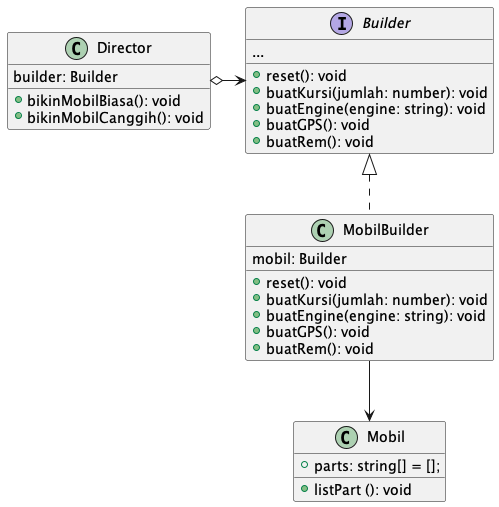

# Creational Design Patterns

Creational Pattern menyediakan berbagai mekanisme dalam pembuatan object, yang mana meningkatkan tingkat flexibility dan penggunaan code yang sudah ada secara berulang

## Factory Method

Factory method merupakan Creational Design Patterns yang menyediakan sebuah interface untuk membuat object di superclass, tapi mengizinkan subclass untuk mengubah Type dari Object yang akan di buat.

<p align="center">
  
</p>

Contoh dalam Typescript:

```ts
interface ISmartphone {
  bikinProduct(): void;
}

class Samsung implements ISmartphone {
  private _tipeProduct: string;

  constructor(tipeProduct: string) {
    this._tipeProduct = tipeProduct
  }

  bikinProduct(): void {
    console.log(`Samsung ${this._tipeProduct}`)
  }
}

class Iphone implements ISmartphone {
  private _tipeProduct: string;
  constructor(tipeProduct: string) {
    this._tipeProduct = tipeProduct
  }

  bikinProduct(): void {
    console.log(`Iphone ${this._tipeProduct}`) 
  }
}

/**************************************************************** */

abstract class AbstractPabrikSmartphone {
  bikinSesuatu(tipeProduct: string): void {
    const hasil: ISmartphone = this.hasilProduct(tipeProduct)
    hasil.bikinProduct()
  }
  abstract hasilProduct(_tipeProduct: string): ISmartphone;
}


class PabrikSamsung extends AbstractPabrikSmartphone {
  hasilProduct(tipeProduct: string): ISmartphone {
    return new Samsung(tipeProduct)
  }
}

class PabrikIphone extends AbstractPabrikSmartphone {
  hasilProduct(tipeProduct: string): ISmartphone {
    return new Iphone(tipeProduct)
  }
}

const pabrikSamsungCikarang: PabrikSamsung = new PabrikSamsung();
pabrikSamsungCikarang.bikinSesuatu('A1')
pabrikSamsungCikarang.bikinSesuatu('J5')

const pabrikIphoneUS: PabrikIphone = new PabrikIphone();
pabrikIphoneUS.bikinSesuatu('13 Pro');
pabrikIphoneUS.bikinSesuatu('12 Mini');
```

## Abstract Factory
Abstract Factory merupakan Creational Design Patterns yang bisa membuat families dari sebuah object tanpa men-spesifikasikan concrete class.

<p align="center">
  
</p>

```ts
interface IKursi {
  adaKaki(): boolean;
}

class KursiLama implements IKursi {
  adaKaki(): boolean {
    return true
  }
}

class KursiModern implements IKursi {
  adaKaki(): boolean {
    return false
  }
}


interface ISofa {
  menggunakanBusa(): boolean;
}

class SofaLama implements ISofa {
  menggunakanBusa(): boolean {
    return false
  }
}

class SofaModern implements ISofa {
  menggunakanBusa(): boolean {
    return true
  }
}

abstract class AbstractPabrikProperti {
  abstract buatKursi(): IKursi
  abstract buatSofa(): ISofa
}

class PabrikPropertiLama extends AbstractPabrikProperti {
  buatKursi(): IKursi {
    return new KursiLama()
  }
  buatSofa(): ISofa {
    return new SofaLama()
  }
}

class PabrikPropertiModern extends AbstractPabrikProperti {
  buatKursi(): IKursi {
    return new KursiModern()
  }
  buatSofa(): ISofa {
    return new SofaModern()
  }
}

class PabrikPropertiMix extends AbstractPabrikProperti {
  buatKursi(): IKursi {
    return new KursiLama()
  }
  buatSofa(): ISofa {
    return new SofaModern()
  }
}

class Ruangan {
  factory: AbstractPabrikProperti;
  constructor(f: AbstractPabrikProperti) {
    this.factory = f;
  }
  buatKursiDalamRuangan(): IKursi {
    return this.factory.buatKursi()
  }
}

const pabrik1: Ruangan = new Ruangan(new PabrikPropertiModern())
console.log(pabrik1.buatKursiDalamRuangan())
```

## Builder
Builder merupakan Creational Design Patterns yang bisa membuat kompleks object step by step. Pattern ini bisa memproduksi berbagai representation yang berbeda - beda menggunakan konstruksi kode yang sama.

<p align="center">
  
</p>

```ts
interface Builder {
  reset(): void;
  buatKursi(jumlah: number): void;
  buatEngine(engine: string): void;
  buatGPS(): void;
  buatRem(): void;
}

class MobilBuilder implements Builder {
  private mobil: Mobil;
  constructor() {
    this.mobil = new Mobil()
  }
  buatKursi(jumlah: number): void {
    this.mobil.parts.push(`Jumlah kursi sebanyak ${jumlah}`)
  }
  buatEngine(engine: string): void {
    this.mobil.parts.push(`Menggunakan jenis engine ${engine}`)
  }
  buatGPS(): void {
    this.mobil.parts.push(`GPS Aktif`)
  }
  buatRem(): void {
    this.mobil.parts.push(`Rem Aktif`)
  }
  reset(): void {
    this.mobil = new Mobil();
  }
  public getProductResult(): Mobil {
    const result = this.mobil
    this.reset()
    return result
  }
}

class Mobil {
  public parts: string[] = [];
  public listPart (): void {
    console.log(`Product parts: ${this.parts.join(', ')}\n`)
  }
}

class Director {
  private builder: Builder;
  constructor(builder: Builder) {
    this.builder = builder;
  }
  public bikinMobilBiasa(): void {
    this.builder.buatEngine('Engine Z100X')
    this.builder.buatKursi(2)
    this.builder.buatRem()
  }

  public bikinMobilCanggih(): void {
    this.builder.buatEngine('Engine T400F')
    this.builder.buatKursi(4)
    this.builder.buatRem()
    this.builder.buatGPS()
  }
}

const builder: MobilBuilder = new MobilBuilder()
const director: Director = new Director(builder)

console.log('Bikin mobil Biasa: ')
director.bikinMobilBiasa()
builder.getProductResult().listPart()

console.log('Bikin mobil Canggih: ')
director.bikinMobilCanggih()
builder.getProductResult().listPart()
```